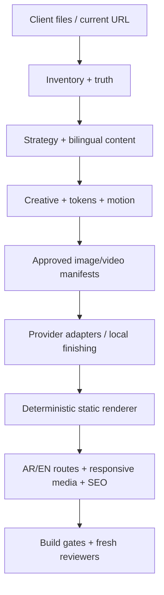

# Functional Internal Studio Alpha architecture

## Scope

هذه أداة تشغيل داخلية، contract-driven، لمواقع Corporate/Brochure فقط. لا يوجد backend
أو قاعدة بيانات أو حسابات مستخدمين. الحالة الدائمة داخل `projects/<slug>/`، والمخرج
موقع static portable.

## Control plane

- `source-inventory.json` و`current-site-inventory.json`: ذاكرة المصادر والهجرة.
- `truth-ledger.json`: حد الحقيقة والنشر.
- `site-strategy.json`: الجمهور والتموضع.
- `creative-direction.json`: الفكرة البصرية والهيرو والمواد.
- `motion-spec.json`: الحركة وبديل reduced-motion.
- `generation-plan.json`: provider/model وأسماء متغيرات البيئة.
- `image-manifest.json` و`video-manifest.json`: slots، provenance، renditions وbudgets.
- `generation-jobs.jsonl`: دليل append-only للطلبات الخارجية، بلا أسرار.

كل عقد mutable يحمل `content_hash` محسوباً من canonical JSON. الفاحص يمنع العقد stale.

## Generation plane

`studio/providers.py` يحتوي adapters قياسية بلا SDK:

- OpenAI Images API للـstill المفاهيمي؛
- Luma Agents generations API لفيديو Ray؛
- polling وتنزيل HTTPS؛
- لا قراءة لمفتاح قبل `--execute`.

`studio/media.py` يستخدم FFmpeg/FFprobe لإنتاج MP4/WebM/Poster وأدلة decode وhash.
المزود الخارجي اختياري: Build يظل صالحاً بالـposter حتى عند فشل الفيديو.

## Renderer and frontend

`scripts/build_site.py` يقرأ العقود ويبني كل route. اللغة العربية `dir=rtl` والإنجليزية
`dir=ltr` باستخدام CSS logical properties. `site-map.routing` يحدد إما chooser في `/`
أو اللغة الأساسية على الجذر.

القالب يطبق:

- semantic light/dark tokens؛
- nav/surface/deep/luminous glass وopaque fallback؛
- responsive picture وvideo sources؛
- no-JS content؛
- poster-first hero؛
- theme/menu/reveal/pointer light كتطوير progressive؛
- إيقاف فيديو وحركة عند reduced motion.

## Deployment boundary

`build/` portable ويمكن نشره على أي static host. Workflow النشر placeholder حتى يُربط
بمضيف فعلي (المسار الحقيقي إلى Traefik VPS يصل في PR منفصل). لا تدّعي هذه النسخة نشر DNS
أو domains أو rollback أو monitoring فعلياً.
