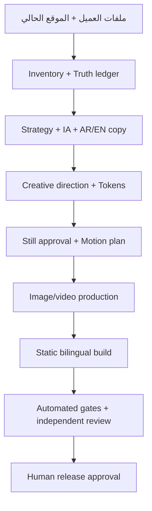

# Studio delivery workflow

## التشغيل الداخلي

`studio-delivery` هو الـconductor. كل مرحلة تنتج عقداً يفهمه المولد والفاحص والمراجع،
لذلك يمكن إيقاف الجلسة واستئنافها من ملفات المشروع بدلاً من الاعتماد على ذاكرة المحادثة.

## المراحل والبوابات

| المرحلة | المخرجات | من يراجع | شرط الانتقال |
| --- | --- | --- | --- |
| الاستقبال | `source-inventory`, crawl inventory | migration reviewer | كل مصدر قابل للتتبع |
| الحقيقة | `truth-ledger` | truth reviewer + العميل | لا ادعاء غير مسند |
| الاستراتيجية | `site-strategy`, sitemap | content/IA reviewer | غرض وجمهور ومسار واضح |
| الكتابة | AR/EN page contracts | مراجعا العربية والإنجليزية | تطابق الحقائق وطبيعية اللغتين |
| الإخراج الفني | `creative-direction`, tokens, manifests | creative director + owner | اتجاه واحد معتمد |
| الحركة | `motion-spec`, still approval | motion/accessibility reviewer | poster وreduced-motion |
| الإنتاج | images/video + provenance | media reviewer | decode/hash/budget pass |
| البناء | HTML/CSS/JS/SEO | deterministic gates | Build أخضر |
| النشر | release evidence | owner/release manager | إذن صريح قابل للتدقيق |

## الفرق بين الفريق والـAgent

الـSkills تنشئ العقود: الاستراتيجية، Copy، الإخراج الفني، الحركة والإنتاج. Agents المراجعة
يعملون بسياق جديد ويصدرون Findings ولا يوافقون على عملهم. الفاحص الحتمي يثبت البنية
والملفات والميزانيات، لكنه لا يقرر أن الهوية “مبهرة” أو أن claim واقعي؛ ذلك يبقى للإنسان.

## استبدال موقع موجود

1. احتفظ بنسخة من ملفات العميل خارج مجلد المشروع وشغّل `intake_files.py`.
2. شغّل crawl dry-run، ثم `--execute` بعد إذن الشبكة.
3. قارِن كل URL حالي بالسitemap الجديد: retain أو consolidate أو redirect أو retire.
4. لا تنقل claim من الموقع القديم إلى الموقع الجديد كحقيقة بلا دليل.
5. ضع لغة الدومين الأساسية عبر `--routing default-locale-root`.
6. لا تغيّر DNS حتى ينجح Build وتُعتمد اللغة والمحتوى والهيرو وخطة redirects.

## Definition of done للـAlpha

- العقود الاستراتيجية والإبداعية والحركية مختومة ومعتمدة.
- كل صفحة موجودة بالعربية والإنجليزية وCTA داخلي صالح.
- كل Still وفيديو يطابق slot مع provenance وhash.
- Hero يعمل كصورة أولاً، فيديو عند الإمكان، وصورة فقط في reduced-motion.
- `scripts/run-checks.sh projects/<slug> build` يمر.
- مراجعات الإنسان والعميل مسجلة.
- النشر وDNS ما زالا خطوة تشغيلية منفصلة ومصرحاً بها.
